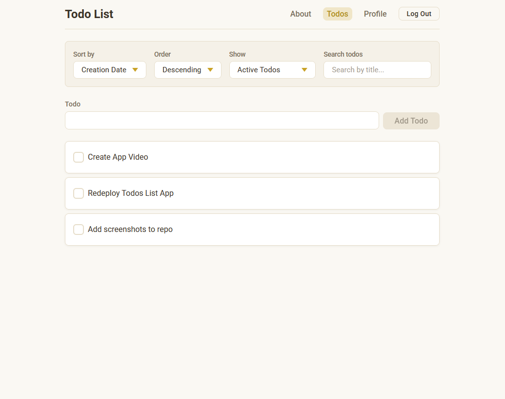
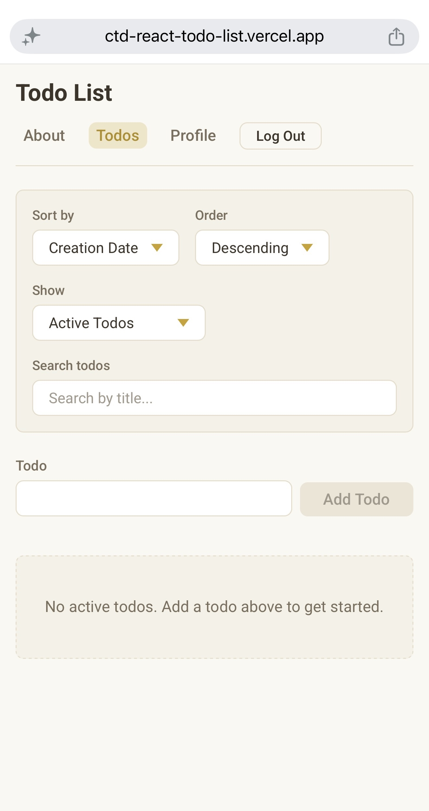

# CTD React Spring 2026 — Todo App

A full-featured todo application built with React, created as the long-term main project for the React Spring 2026 cohort at [Code the Dream](https://codethedream.org/).

I actually started this class in a previous cohort but had to defer for various reasons. In the time between cohorts I completed the Scrimba markdown course, so this README is a good bit better than my first attempt at one. This project grew week by week across the course, starting as static components and ending as a routed, authenticated, API-backed application with a custom design.

## Live Demo

<!-- TODO: Replace with the live Vercel URL once deployed -->
_Coming soon — deployment pending._

## Screenshots




## Features

- Create, edit, complete, and un-complete todos
- Sort todos by creation date or title, ascending or descending
- Search todos by title with debounced input
- Filter todos by status (all, active, completed)
- User authentication with protected routes
- Input validation and sanitization

## Technologies Used

- **Framework:** React
- **Routing:** React Router
- **State Management:** useReducer and Context API
- **Build Tool:** Vite
- **Styling:** CSS Modules
- **Security:** DOMPurify for input sanitization
- **API:** Code the Dream provided backend

## Getting Started

### Prerequisites

- Node.js (version 18 or higher recommended)
- npm

### Installation

This repository was originally created with:

```bash
npx create-vite@latest --template react .
```

To set it up locally, clone the repository, then install dependencies:

```bash
npm install
```

This project talks to the Code the Dream backend through a proxy. Local API requests to `/api/*` are forwarded by Vite during development.

## Available Scripts

- `npm run dev` — start the development server (default port 5173)
- `npm run build` — create an optimized production build
- `npm run preview` — preview the production build locally
- `npm run lint` — run ESLint across the project

You can specify a different dev-server port with:

```bash
npm run dev -- --port 8080
```

The live view is then accessible at `http://localhost:5173` (or whichever port you set).

## Design Decisions

I styled the app with **CSS Modules**, which keeps class names scoped to each component and avoids the global-namespace conflicts that plain CSS can cause at scale. It also needs no extra setup in Vite.

For the visual direction, I went with a "notes app" feel, inspired by commonly used apps like Google's Keep and Apple's Notes, with a beige and cream palette with gold/ochre accents. Text uses a deep warm brown for readability and to keep good color contrast for accessibility, while gold is reserved for accents, active states, and highlights. The app uses Roboto throughout, custom-styled checkboxes, and a consistent set of design tokens (colors, spacing, radius) defined once and reused everywhere.

State is managed with `useReducer` for the todo list and the Context API for authentication. Performance-sensitive spots use memoization, and the search input is debounced to avoid firing a request on every keystroke.

## Future Improvements

- Deploy the app live and add the demo link
- Add a delete-todo feature
- Add dark/light theme toggle
- Drag-and-drop reordering of todos

## License

This project is licensed under the MIT License — see the [LICENSE](./LICENSE) file for details.

## Contact

Created by Hector Ayala — [GitHub profile](https://github.com/hjayala)